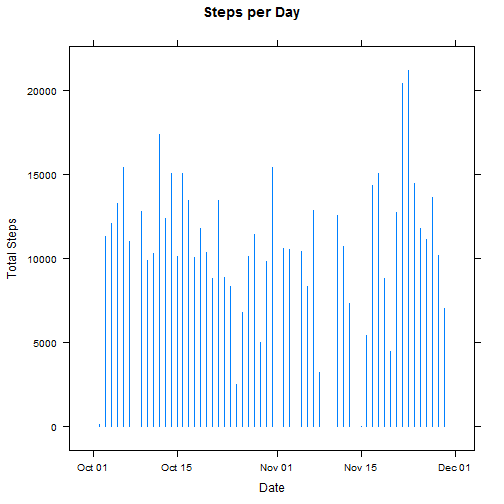
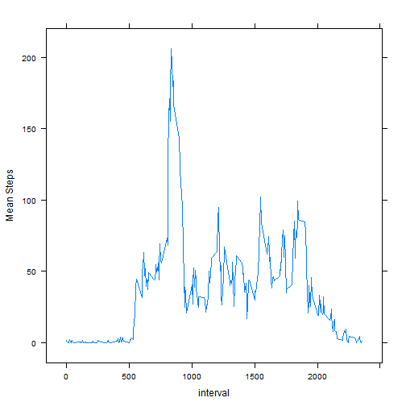
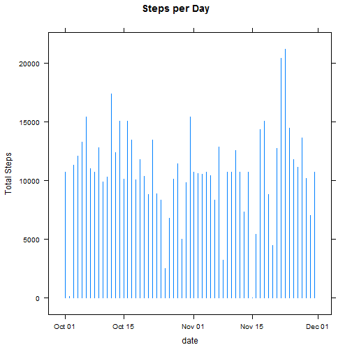
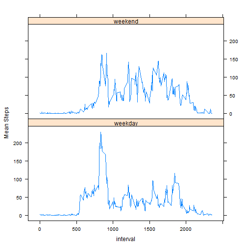

#Project 1 - Reproducible Research

### Part 1 - Load the data and necessary libraries

```r
setwd("C:/Users/markmo/SkyDrive/Learning/DataScience/Course5-ReproducibleResearch/data")
#load libraries
library(dplyr)
library(lattice)
#load data
activityRaw <- read.csv("activity.csv")
activity <- tbl_df(activityRaw)
```

### Part 2 - Display a histogram of steps per day and calculate mean and median steps per day

```r
# Group and Sum the data by date
byDay <- group_by(activity, date)
SumByDay <- summarise(byDay, sum(steps))
names(SumByDay) <- c("Date", "TotalSteps")
SumByDay$Date <- as.Date(SumByDay$Date)
# Show histogram
xyplot(TotalSteps ~ Date, data=SumByDay, type="h", ylab="Total Steps", main="Steps per Day")
```

 

```r
#Calculate Mean and Median total steps per day and display:
mean(SumByDay$TotalSteps, na.rm=TRUE)     
```

```
## [1] 10766.19
```

```r
median(SumByDay$TotalSteps, na.rm=TRUE)   
```

```
## [1] 10765
```

### Part 3 - Show the average daily activity pattern
The time series plot shown below indicates the average daily activity pattern in 5-minute intervals.

```r
#first need to clean the NAs out 
NAs <- is.na(activity$steps)
activityClean = activity[!NAs,]
# group by interval across all days
byInterval <- group_by(activityClean, interval)
#calculate mean by interval
MeanByInterval <- summarise(byInterval, m=mean(steps))

#show plot
xyplot(m~interval, data = MeanByInterval, type='l', ylab = "Mean Steps")
```

 

The interval with the maximum average number of steps is:

```r
MaxMean <- max(MeanByInterval$m)
filter(MeanByInterval, m >= MaxMean)
```

```
## Source: local data frame [1 x 2]
## 
##   interval        m
## 1      835 206.1698
```

### Part 4a - Impute missing values and create a new dataset with these imputed values
Calculate and report the total number of missing values in the dataset

```r
# The total number of missing values:
sum(is.na(activity$steps))
```

```
## [1] 2304
```
Impute missing values by using the calculated mean for each interval across all of the days (from Part 3).
Replace the NAs in the steps column with the calculated mean.

```r
# create an activityImputed table by joining activity and MeanByInterval
activityImputed <- inner_join(activity, MeanByInterval, by = c("interval" = "interval"))
# replace NAs in the steps column with the mean by interval column
activityImputed$steps[is.na(activityImputed$steps)] <- activityImputed$m
```

```
## Warning in activityImputed$steps[is.na(activityImputed$steps)] <-
## activityImputed$m: number of items to replace is not a multiple of
## replacement length
```

```r
#check that NAs are gone in activityImputed and values are consistent with activityRaw
summary(activityImputed)
```

```
##     interval          steps                date             m          
##  Min.   :   0.0   Min.   :  0.00   2012-10-01:  288   Min.   :  0.000  
##  1st Qu.: 588.8   1st Qu.:  0.00   2012-10-02:  288   1st Qu.:  2.486  
##  Median :1177.5   Median :  0.00   2012-10-03:  288   Median : 34.113  
##  Mean   :1177.5   Mean   : 37.38   2012-10-04:  288   Mean   : 37.383  
##  3rd Qu.:1766.2   3rd Qu.: 27.00   2012-10-05:  288   3rd Qu.: 52.835  
##  Max.   :2355.0   Max.   :806.00   2012-10-06:  288   Max.   :206.170  
##                                    (Other)   :15840
```

```r
summary(activityRaw)
```

```
##      steps                date          interval     
##  Min.   :  0.00   2012-10-01:  288   Min.   :   0.0  
##  1st Qu.:  0.00   2012-10-02:  288   1st Qu.: 588.8  
##  Median :  0.00   2012-10-03:  288   Median :1177.5  
##  Mean   : 37.38   2012-10-04:  288   Mean   :1177.5  
##  3rd Qu.: 12.00   2012-10-05:  288   3rd Qu.:1766.2  
##  Max.   :806.00   2012-10-06:  288   Max.   :2355.0  
##  NA's   :2304     (Other)   :15840
```

```r
# remove the m column now that NAs are copied over:
activityImputed <- activityImputed[,1:3]
```
###Part 4b - Display a histogram of steps per day (in the new table with imputed values) and calculate mean and median steps per day

```r
# Group by date
byDayI <- group_by(activityImputed, date)
SumByDayI <- summarise(byDayI, TotalSteps=sum(steps))
SumByDayI$date <- as.Date(SumByDayI$date)

# Show histogram
xyplot(TotalSteps ~ date, data=SumByDayI, type="h", ylab="Total Steps", main="Steps per Day")
```

 

```r
#Calculate Mean and Median total steps per day and display:
mean(SumByDayI$TotalSteps)
```

```
## [1] 10766.19
```

```r
median(SumByDayI$TotalSteps)    
```

```
## [1] 10766.19
```
Note that since we replaced missing values with means calculated across the original dataset, the mean of total steps per day is identical to the mean in our original dataset.  Median now matches the mean, and is slightly higher than the median from the original dataset.

###Part 5 - Explore differences between activity patterns in weekdays and weekend days.  The plot below shows the difference in activity.

```r
# Create a new factor variable in the dataset with two levels - "weekday" and "weekend" indicating 
# whether a given date is a weekday or weekend day.
## create a copy of the activityImputed table
activityImputedWeekday <- activityImputed
## add a weekday column, with the weekday corresponding to its date
activityImputedWeekday$weekday <- weekdays(as.Date(activity$date))
## replace Saturday & Sunday with "weekend"
activityImputedWeekday$weekday[activityImputedWeekday$weekday == "Sunday"] <- "weekend"
activityImputedWeekday$weekday[activityImputedWeekday$weekday == "Saturday"] <- "weekend"
## replace other days of week with "weekday"
activityImputedWeekday$weekday[activityImputedWeekday$weekday != "weekend"] <- "weekday"
## convert weekday column to factor and change its name
activityImputedWeekday$weekday <- as.factor(activityImputedWeekday$weekday)
names(activityImputedWeekday)[4] <- "daytype"

# Show a panel time series plot of the 5-minute interval and average number of steps taken, averaged 
# across all weekday days or weekend days.

# Group by interval and day type
byDaytypeInterval <- group_by(activityImputedWeekday, daytype, interval)
MeanByDaytypeI <- summarise(byDaytypeInterval, MeanSteps=mean(steps))

#show the plot
xyplot(MeanSteps~interval | daytype, data = MeanByDaytypeI, layout=c(1,2), type='l', ylab = "Mean Steps")
```

 
